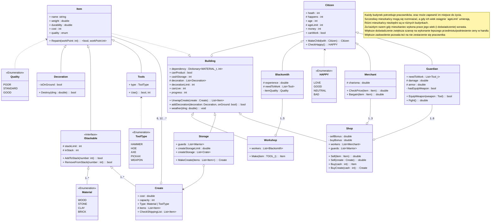

```mermaid
classDiagram
    class Quality{
        <<Enumeration>>
        POOR
        STANDARD
        GOOD
    }
    class Item{
        + name :string
        + weight : double
        + durability : double
        + cost : int
        + quality : enum
        + Repaint(workPoint: int) : ~bool, workPoint:int~
    }
    class Decoration{
        - isOnGround : bool
        + Destroy (dmg : double) : bool
    }
    class IStackable{
        <<Interface>>
        # stackLimit : int
        # inStack : int
        + AddToStack(number: int) : bool
        + RemoveFromStack(number : int) : bool
    }
    class Material{
        <<Enumeration>>
        WOOD
        STONE
        CLAY
        BRICK
    }
    class ToolType{
        <<Enumeration>>
        HAMMER
        HOE
        AXE
        PICKAX
        WEAPON
    }
    class Tools{
        + type : ToolType
        + Use() : bool, int
    }

    class Create{
        + cost : double
        + capacity : int
        + Type: Material | ToolType
        # items : List~Item~
        + CheckShippingList : List~Item~
    }

    class Building{
        + dependency : Dictionary~MATERIAL_t, int~
        + canProduct : bool
        + cashStorage : int
        # decoration : List~Decoration~
        + decorationLimit : int
        + canLive : int
        + progress : int

        + UnwrapCreate(create : Create) : List~Item~
        + addDecoration(decoration: Decoration, onGround: bool) : bool
        + weather (dmg: double) : void
    }
    class Storage{
        + guards : List~Warrior~
        + createStorageLimit : double
        + createStorage : List~Crate~
        + MakeCreate(items : List~Item~) : Create
    }
    class Workshop{
        + workers : List~Blacksmith~
        + Make(item : TOOL_t) : Item
    }
    class Shop{
        - sellBonus : double
        - buyBonus  : double
        + workers : List~Merchant~
        + guards : List~Warrior~
        + Sell(item : Item) : double
        + Sell(create : Create) : double
        + Buy(cash : int) :  Item
        + BuyCreate(cash : int) : Create
    }

    class Citizen{
        + heath : int
        # happens : int
        + age : int
        # ageLimit : int
        + money : int
        + canWork : bool

        + MakeChild(with : Citizen) : Citizen
        + CheckHappy() : HAPPY
    }

    class HAPPY{
        <<Enumerator>>
        LOVE
        GOOD
        NEUTRAL
        BAD
    }

    class Blacksmith{
        # experience : double
        # needToWork : List~Tool~
        - itemQuality : Quality
    }
    class Merchant{
        # charisma : double
        + CheckPrice(item : Item) : double
        + Bargain(item : Item) : double
    }
    class Guardian{
        + needToWork : List~Tool_t~
        # damage : double
        # armor : double
        - hasEquipWeapon : bool
        + EquipWeapon(weapon : Tool) : bool
        + Fight() : double
    }


    Item <.. Quality
    Tools <.. ToolType

    Item <|-- Decoration
    Item <|-- IStackable
    Item <|-- Tools
    IStackable <|-- Material : 1..*
    IStackable <|-- Create : 1..*


    Item --o Create : 6, 12, ..*
    Citizen --o Building
    Blacksmith --o Workshop : 1..5
    Citizen <|-- Blacksmith

    Building <|-- Workshop
    Building <|-- Storage
    Building <|-- Shop

    Storage o--> Create
    Item ..|> Building

    Citizen <.. HAPPY
    Citizen <|-- Merchant
    Citizen <|-- Guardian
    

    Merchant --o Shop : 1..3
    Guardian --o Shop : 1..6

    note "Każdy budynek potrzebuje pracowników, oraz może zapewnić im miejsce do życia.
    Szczesliwy mieszkańcy mogą się rozmnażać, a gdy ich wiek osiągnie `ageLimit` umierają.
    Różni mieszkańcy niezbędni są w różnych budynkach. 
    Za każdym razem gdy mieszkaniec wykona prace jego wiek (i doświadczenie) wzrasta.
    Większe doświadczenie zwiększa szansę na wykonanie lepszego przedmiotu/podniesienie ceny w handlu
    Większe zadowolenie pozwala też na nie zestarzenie się pracownika"
```