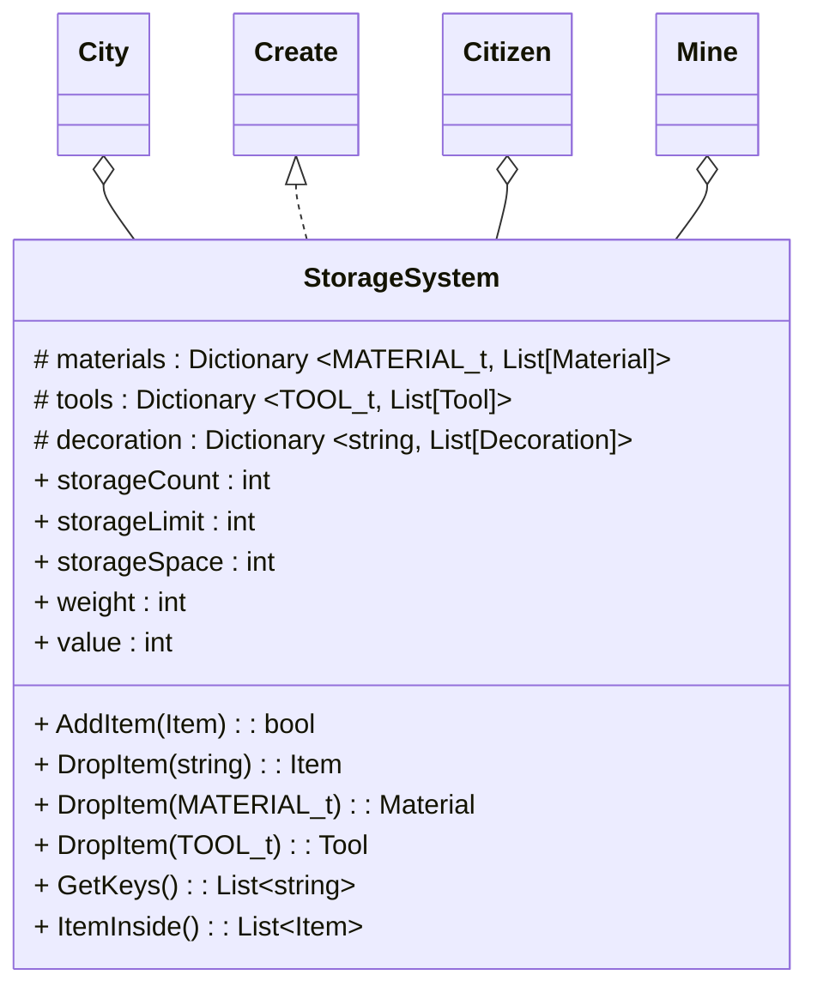

```mermaid
classDiagram

class StorageSystem{
    # materials : Dictionary ~MATERIAL_t, List[Material]~
    # tools : Dictionary ~TOOL_t, List[Tool]~
    # decoration : Dictionary ~string, List[Decoration]~
    + storageCount : int
    + storageLimit : int
    + storageSpace : int
    + weight : int
    + value : int
    + AddItem(Item) : bool
    + DropItem(string): Item
    + DropItem(MATERIAL_t): Material
    + DropItem(TOOL_t): Tool
    + GetKeys(): List~string~
    + ItemInside(): List~Item~
}

class Mine{
     
}

class City{
    
}

class Citizen{
    
}

class Create{
 
}


City o-- StorageSystem
Create <|.. StorageSystem
Citizen  o-- StorageSystem
Mine o-- StorageSystem
```
