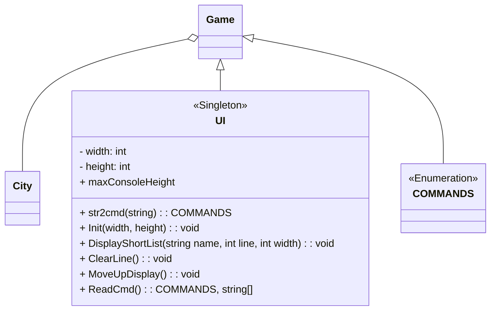

```mermaid
classDiagram
    class COMMANDS{
        <<Enumeration>>
         
    }
    class UI{
        <<Singleton>>
        - width: int
        - height: int
        + maxConsoleHeight

        + str2cmd(string) : COMMANDS


        + Init (width, height) : void
        + DisplayShortList(string name, int line, int width): void
        + ClearLine(): void
        + MoveUpDisplay(): void

        + ReadCmd() : COMMANDS, string[]
    }

    class Game{

    }

    class City {

    }

    Game o-- City
    Game <|-- UI
    Game <|-- COMMANDS
```