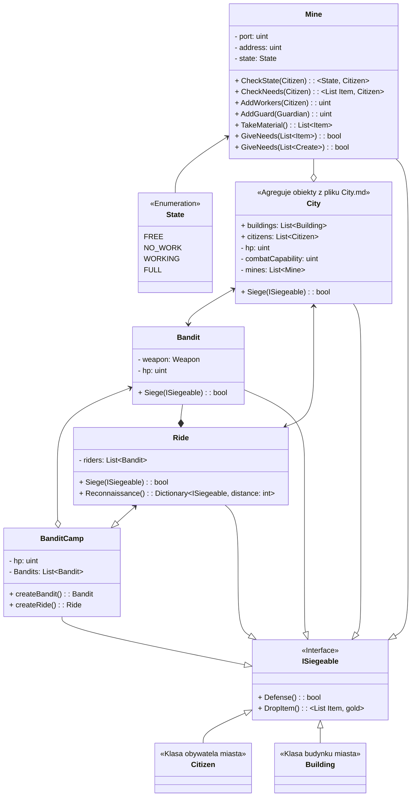

```mermaid
classDiagram
    class City{
        <<Agreguje obiekty z pliku City.md>>
        + buildings: List~Building~
        + citizens: List~Citizen~
        - hp: uint
        - combatCapability: uint
        - mines: List~Mine~
        + Siege(ISiegeable): bool
    }
    class Citizen{
        <<Klasa obywatela miasta>>
    }
    class Building{
        <<Klasa budynku miasta>>
    }

    class Bandit {
        - weapon: Weapon
        - hp: uint
        + Siege(ISiegeable): bool
    }

    class Ride {
        - riders: List~Bandit~
        + Siege(ISiegeable): bool
        + Reconnaissance(): Dictionary~ISiegeable, distance: int~
    }

    class BanditCamp{
        - hp: uint
        - Bandits: List~Bandit~
        + createBandit(): Bandit
        + createRide(): Ride
    }

    class ISiegeable{
        <<Interface>>
        + Defense(): bool
        + DropItem(): ~List Item, gold~
    }


    class State{
        <<Enumeration>>
        FREE
        NO_WORK
        WORKING
        FULL
    }

    class Mine{
        - port: uint
        - address: uint
        - state: State

        + CheckState(Citizen): ~State, Citizen~
        + CheckNeeds(Citizen): ~List Item, Citizen~
        + AddWorkers(Citizen): uint
        + AddGuard(Guardian): uint
        + TakeMaterial(): List~Item~
        + GiveNeeds(List~Item~): bool
        + GiveNeeds(List~Create~): bool
    }


    

    Bandit <--o BanditCamp
    Bandit --* Ride
    Ride <--|> BanditCamp

    Bandit --|> ISiegeable
    Ride   --|> ISiegeable
    BanditCamp --|> ISiegeable

    City <--> Bandit
    City <--> Ride
    City --|> ISiegeable

    Mine <-- State
    Mine --o City
    Mine --|> ISiegeable

    ISiegeable <|-- Citizen
    ISiegeable <|-- Building
```